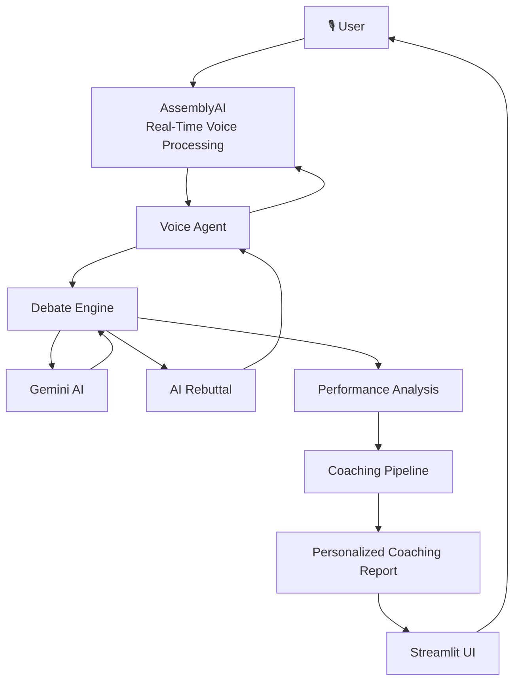

# ⚔️ AI Debate Arena

> **Speak. Think. Defend. Improve.**

AI Debate Arena is a **voice-first AI debate platform** where users can participate in a real-time debate against an AI opponent, defend their position using natural speech, and receive a personalized coaching report after the debate.

Instead of typing arguments into a chatbot, users simply **speak**.

The system listens, transcribes the user's argument in real time, generates an adaptive AI rebuttal, speaks the response back to the user, evaluates the debate, and finally provides personalized feedback and practice exercises.

---

## 🎯 The Problem

Traditional AI chatbots make it easy to generate answers, but they do not recreate the pressure and spontaneity of a real debate.

Students and learners often struggle with:

- Thinking quickly under pressure
- Structuring arguments clearly
- Responding to counterarguments
- Maintaining relevance during a discussion
- Supporting claims with reasoning
- Identifying weaknesses in their arguments
- Knowing exactly how to improve after practice

Most existing AI tools focus on **conversation or text generation** rather than creating a complete interactive debate-and-coaching experience.

---

## 💡 The Solution

AI Debate Arena turns debate practice into an interactive **voice-based arena**.

The user:

1. Chooses a debate topic.
2. Chooses a position.
3. Starts the voice debate.
4. Speaks naturally.
5. Receives a real-time AI rebuttal.
6. Responds to the rebuttal.
7. Completes multiple debate rounds.
8. Receives an automatically generated performance report.
9. Gets personalized coaching recommendations and practice exercises.

The entire core experience is designed around **speaking rather than typing**.

---

# ✨ Key Features

## 🎙️ Voice-First Debate Experience

Users can participate in the debate using their microphone instead of typing arguments.

The system captures speech in real time and converts it into text for debate processing.

This makes the experience closer to an actual spoken debate.

---

## ⚡ Real-Time Speech Transcription

AI Debate Arena uses **AssemblyAI's real-time voice technology** to process the user's speech.

The application receives progressive speech updates while the user is speaking and maintains the final argument separately for reliable debate processing.

This allows the interface to provide live feedback without corrupting the actual debate state.

---

## 🤖 Adaptive AI Opponent

The AI opponent does not simply generate random responses.

The debate engine maintains the state of the conversation and uses the user's arguments to generate relevant rebuttals.

The AI opponent responds according to:

- The debate topic
- The user's selected position
- The user's previous arguments
- The current debate round
- The current turn
- The AI's previous arguments

This creates a more structured debate experience.

---

## ⚔️ Multi-Round Debate

AI Debate Arena supports a structured multi-round debate.

Each round contains:

- User argument
- AI response
- Debate state update
- Argument tracking
- Performance tracking

The current implementation uses a **3-round debate flow** for the main experience.

---

## 🧠 Structured Debate Engine

The debate engine maintains structured state rather than treating the conversation as an unstructured chat.

The system tracks information such as:

- Debate topic
- User position
- AI position
- Current round
- Current turn
- User arguments
- AI arguments

Arguments are represented using structured objects containing information such as:

- Speaker
- Argument text
- Round
- Turn

This allows later analysis to operate on the actual debate history.

---

# 📊 Post-Debate Performance Analysis

After the debate finishes, AI Debate Arena analyzes the completed debate.

The performance analysis pipeline examines characteristics such as:

- Argument quality
- Reasoning
- Relevance
- Structure
- Counterargument handling
- Debate consistency
- Overall performance

The goal is not simply to give the user a score.

The system uses the debate history to identify **what the user did well and what they should improve**.

---

# 🎯 Personalized AI Coaching

One of the major features of AI Debate Arena is its personalized coaching system.

Instead of showing the same generic feedback to every user, the system builds a structured coaching profile from the user's debate performance.

The coaching pipeline includes:

- Performance summary
- Coaching profile
- Strength identification
- Improvement areas
- Personalized improvement priorities
- Important debate moments
- Actionable coaching recommendations
- Practice exercises

This transforms the application from a simple AI debate opponent into an **AI debate coach**.

---

# 🏋️ Practice Exercises

The coaching system can provide practical exercises based on identified weaknesses.

For example, a user who struggles with counterarguments may receive exercises focused on:

- Identifying opposing claims
- Responding to counterarguments
- Building rebuttals
- Supporting claims with reasoning

The objective is to turn feedback into **actionable practice**.

---

# 📋 Automatic Post-Debate Report

Once the final debate round is completed, the application automatically generates the post-debate coaching experience.

The user does not need to manually request a report.

The interface presents:

- Coaching Session Summary
- AI Coaching Assessment
- Debate Coaching Profile
- Strengths
- Improvement Areas
- Personalized Improvement Priorities
- Important Moments
- Coaching Recommendations
- Practice Exercises

---

# 🏗️ System Architecture



---

# 🧩 Core Components

## 🎙️ Voice Agent

The voice agent manages the real-time spoken interaction.

Its responsibilities include:

- Connecting to AssemblyAI
- Receiving microphone input
- Handling real-time transcription
- Detecting speech turns
- Sending completed user arguments to the debate engine
- Receiving authoritative AI rebuttals
- Handling AI speech
- Managing voice events
- Handling connection errors and reconnection

The voice layer is intentionally separated from the debate logic.

This allows the debate engine to remain the authoritative source of debate state.

---

## ⚔️ Debate Engine

The Debate Engine is responsible for the actual debate logic.

It manages:

- Debate state
- User position
- AI position
- Debate rounds
- Turns
- Argument history
- AI rebuttal generation

The voice agent does not independently decide what the AI should argue.

Instead:

```text
User Speech
     ↓
AssemblyAI
     ↓
Voice Agent
     ↓
Debate Engine
     ↓
AI Rebuttal
     ↓
Voice Agent
     ↓
Spoken AI Response
```

This separation helps prevent duplicate or conflicting AI responses.

---

# 🧠 Performance & Coaching Pipeline

After the debate is completed, the debate history is passed through the analysis pipeline.

```text
Completed Debate
       ↓
Performance Summary
       ↓
Coaching Profile
       ↓
Strengths
       ↓
Improvement Areas
       ↓
Personalized Priorities
       ↓
Recommendations
       ↓
Practice Exercises
```

The coaching system is deterministic at the profile-analysis stage and operates on the structured performance summary.

---

# 🔊 AssemblyAI Integration

AssemblyAI is used for the voice-first interaction layer.

The application uses AssemblyAI real-time voice capabilities to:

- Capture spoken input
- Transcribe speech
- Detect speech activity
- Stream transcription events
- Support real-time voice interaction

The system also handles progressive transcription updates carefully.

The UI displays the latest live transcription update rather than repeatedly appending partial transcripts.

The completed user argument is still handled separately by the debate engine.

---

# 🤖 Gemini Integration

Google Gemini is used as part of the AI reasoning and generation layer.

The AI model is responsible for helping generate:

- Debate responses
- AI arguments
- Rebuttals
- Coaching-related content

The Debate Engine remains responsible for controlling the debate structure and state.

This separation allows the language model to focus on reasoning and generation while the application controls the actual debate flow.

---

# 🎨 Frontend

The application uses **Streamlit** for the user interface.

The interface includes:

- Debate setup
- Topic selection
- Position selection
- Voice debate controls
- Live debate dashboard
- Live speech transcription
- Debate metrics
- AI response display
- Post-debate coaching
- Performance insights
- Practice recommendations

The interface follows a dark, modern "debate arena" visual style.

---

# 🛠️ Tech Stack

| Technology | Purpose |
|---|---|
| Python | Core application logic |
| Streamlit | Frontend and interactive UI |
| AssemblyAI | Real-time voice processing and transcription |
| Google Gemini | AI reasoning and response generation |
| PyAudio | Local microphone/audio handling |
| SoundDevice | Audio processing |
| WebSockets | Real-time communication |
| Pytest | Automated testing |
| Git | Version control |
| GitHub | Source code and project hosting |

---

# 📁 Project Structure

```text
AI_Debate_Arena/
│
├── frontend/
│   └── app.py
│
├── scripts/
│   ├── assemblyai_connection_check.py
│   └── ...
│
├── src/
│   └── debate_arena/
│       │
│       ├── debate/
│       │   ├── debate_engine.py
│       │   ├── debate_state.py
│       │   ├── argument.py
│       │   ├── performance_summary.py
│       │   ├── coaching_profile.py
│       │   └── ...
│       │
│       ├── voice/
│       │   └── voice_agent.py
│       │
│       ├── llm/
│       │   └── ...
│       │
│       ├── tts/
│       │   └── ...
│       │
│       └── config/
│           └── settings.py
│
├── tests/
│   └── ...
│
├── .env
├── .env.example
├── .gitignore
├── pyproject.toml
├── requirements.txt
└── README.md
```

---

# 🧪 Testing

The project includes an automated test suite covering the core application components.

Current baseline:

```text
690 tests passed
```

The project also uses direct compilation checks for the Streamlit frontend.

Example:

```powershell
python -m py_compile .\frontend\app.py
pytest -q
```

Successful execution of these checks confirms that the current codebase passes the established automated test suite and that the frontend file compiles successfully.

---

# 🚀 Getting Started

## 1. Clone the repository

```bash
git clone https://github.com/Sharannya26/AI-Debate-Arena.git
cd AI-Debate-Arena
```

---

## 2. Create a virtual environment

```bash
python -m venv .venv
```

Activate it on Windows:

```powershell
.\.venv\Scripts\Activate.ps1
```

---

## 3. Install dependencies

```powershell
python -m pip install -r requirements.txt
```

---

## 4. Configure environment variables

Create a local `.env` file.

Use your own API credentials locally.

Example:

```env
ASSEMBLYAI_API_KEY=your_assemblyai_api_key_here
```

Do **not** commit real API keys to GitHub.

The `.env` file is intentionally ignored by Git.

---

## 5. Run the application

```powershell
streamlit run frontend/app.py
```

The application will open in your browser.

---

# 🎤 How to Use

### Step 1 — Choose a topic

Enter or select a debate topic.

Example:

```text
Money can buy happiness.
```

### Step 2 — Choose your position

Select either:

```text
SUPPORT
```

or:

```text
OPPOSE
```

### Step 3 — Enter the arena

Start the voice debate.

### Step 4 — Speak

Give your argument naturally through the microphone.

### Step 5 — Listen to the AI

The AI analyzes your argument and responds with a rebuttal.

### Step 6 — Continue the debate

Respond to the AI and continue through the debate rounds.

### Step 7 — Receive your coaching report

After the final round, the application automatically generates your personalized post-debate analysis.

---

# 🏆 Why AI Debate Arena?

AI Debate Arena combines several capabilities into one continuous experience:

```text
Voice Input
     +
Real-Time Transcription
     +
AI Reasoning
     +
Structured Debate Logic
     +
Voice Output
     +
Performance Analysis
     +
Personalized Coaching
```

Instead of simply asking an AI a question, the user has to **think, speak, defend, respond, and improve**.

The system therefore creates a complete loop:

```text
Practice
   ↓
Debate
   ↓
Analyze
   ↓
Identify Weaknesses
   ↓
Practice Again
   ↓
Improve
```

---

# 💡 What Makes It Different?

AI Debate Arena is designed around the idea of **active AI-assisted learning**.

The AI is not only answering the user.

It acts as:

- 🗣️ Conversation partner
- ⚔️ Debate opponent
- 🧠 Reasoning engine
- 📊 Performance evaluator
- 🎯 Personalized coach

The combination of these roles creates a more complete learning experience than a standard text chatbot.

---

# 🔮 Future Scope

Potential future improvements include:

- 🌍 Multiple languages
- 🎚️ Adjustable debate difficulty
- 🧑‍⚖️ Different AI opponent personalities
- 🏆 Leaderboards
- 👥 Multiplayer debates
- 📈 Long-term progress tracking
- 🗣️ Advanced speech analytics
- 📚 Topic-specific debate modes
- 🎓 Classroom integration
- 🧠 More advanced argument-fallacy detection
- 📊 Historical performance dashboards

---

# 🔐 Security

API credentials should never be committed to the repository.

The project uses environment variables for sensitive credentials.

The repository intentionally keeps:

```text
.env
```

out of version control.

For local development, create your own `.env` file and provide your own API credentials.

---

# 📜 License

This project is currently intended as a hackathon project.

---

# 👩‍💻 Author

**Sharannya**

First-year Computer Engineering student exploring:

- 🤖 Artificial Intelligence
- 🎙️ Voice AI
- 🧠 Generative AI
- 💻 Software Engineering
- 🏆 Hackathons

Built as an AssemblyAI hackathon project.

---

# ⭐ Acknowledgements

Special thanks to the technologies that made this project possible:

- AssemblyAI
- Google Gemini
- Streamlit
- Python
- Pytest
- GitHub

---

## ⚔️ AI Debate Arena

**Speak. Think. Defend. Improve.**
